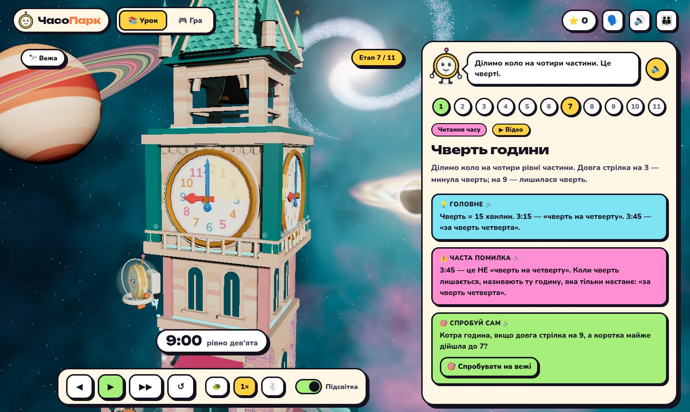
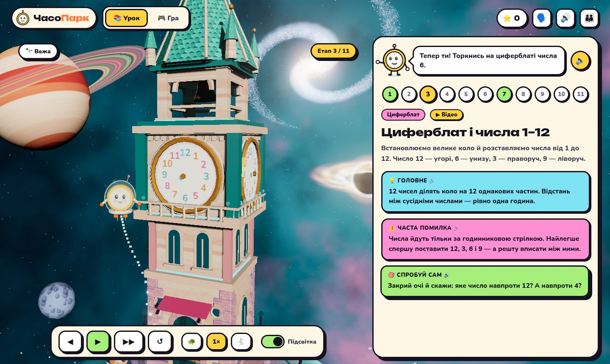
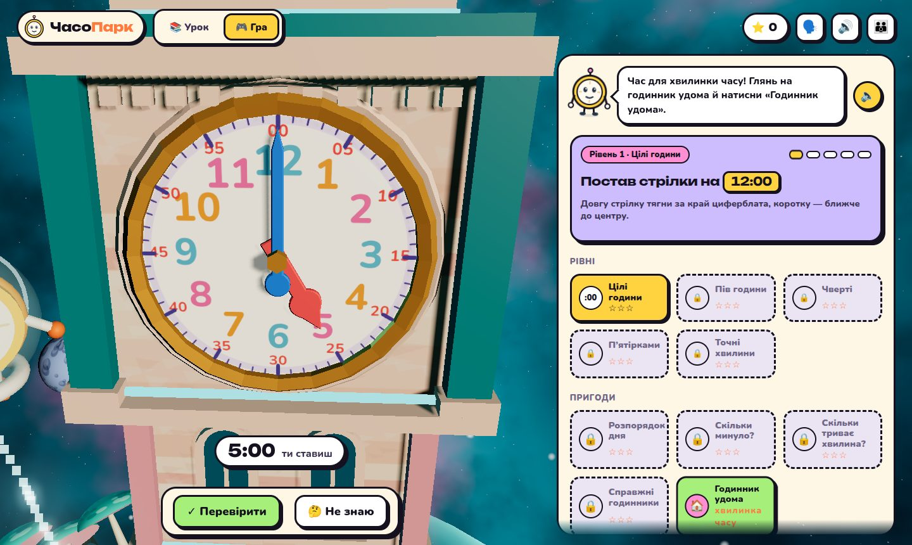
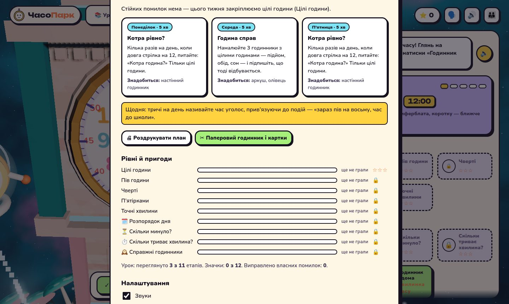
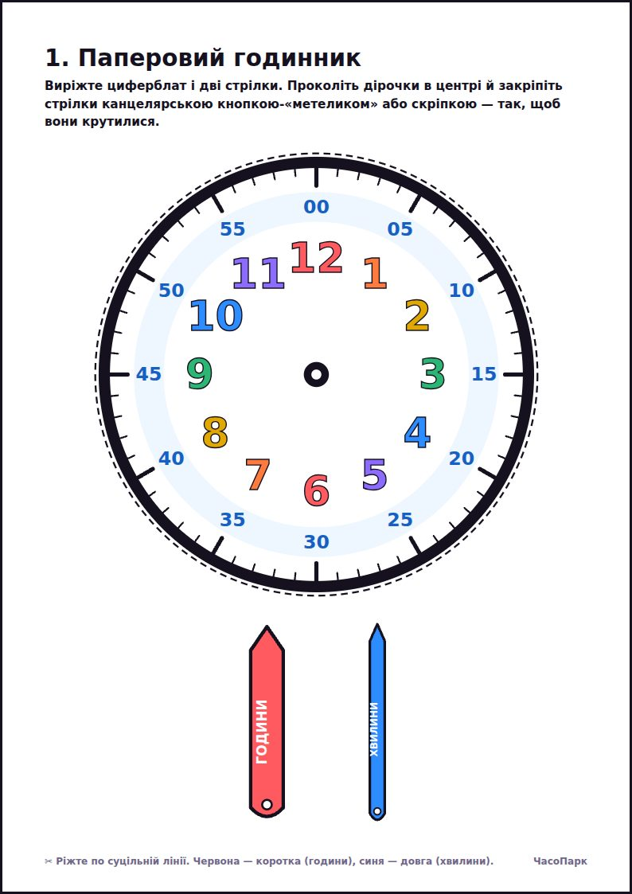
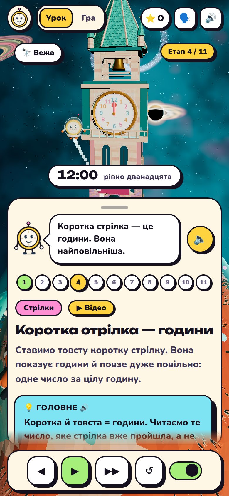
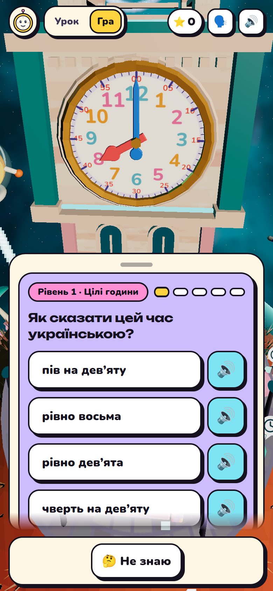
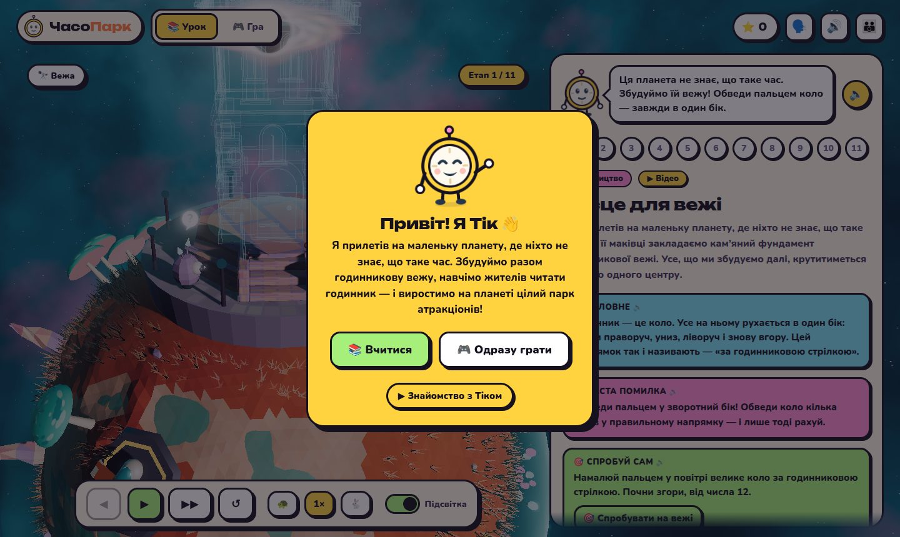

<div align="center">


# 🪐 Зоряний ЧасоПарк

### Гра, у якій діти 6–10 років крок за кроком учаться читати годинник зі стрілками

**Тік прилетів на маленьку планету, де ніхто не знає, що таке час. Разом із дитиною він будує годинникову вежу — і жителі планети вчаться жити за годинником.**

<br>

[](https://chasopark.vercel.app)

<br>


-7EE3F2?style=flat-square&labelColor=15111F)


[](https://github.com/HubYura/TikTak/actions/workflows/ci.yml)


<br>



</div>

---

## ✨ Чому ЧасоПарк

> Аналоговий годинник — одна з найважчих тем початкової школи: дві стрілки, два значення одного числа, шістдесяткова лічба, «пів на» і «за чверть». ЧасоПарк розбирає її на **11 маленьких кроків**, показує кожен у 3D і дає одразу спробувати руками.

| | |
|---|---|
| 🧠 **Методика, а не мультик** | 11 етапів від «що таке коло» до 24-годинного формату. Кожен етап — одна ідея, одна часта помилка і одна дія. |
| 🗣️ **Для тих, хто ще не читає** | Тік зачитує все: пояснення, підказки, варіанти відповідей. Біля кожного варіанта — кнопка 🔊. |
| ✋ **«Тепер ти!»** | Після пояснення дитина сама обводить коло, торкається числа, ставить стрілки — прямо на 3D-вежі. |
| 🎯 **Адаптивний тренажер** | Гра помічає, на якій з **8 типових помилок** спотикається дитина, і частіше дає саме такі завдання. |
| 📅 **Для старших — «Плануємо день»** | Для 9–10 років: коли закінчиться фільм, коли вирушив потяг, скільки тривав політ через північ — у 24-годинному форматі, з поясненням кожної типової помилки. |
| 🏠 **Годинник удома** | Щодня «хвилинка часу»: подивись на справжній годинник і постав стрілки так само. Гра звіряє з реальним часом. |
| 👪 **Звіт для батьків** | Прогрес, активність за 2 тижні, помилки з поясненнями і **план на тиждень**: три 5-хвилинні заняття вдома. |
| ✂️ **Набір для друку** | Паперовий годинник, піца-годинник, картки «ранок / день / вечір / ніч», розклад дня — 4 аркуші A4. |
| 🔒 **Приватно** | Жодних акаунтів, реклами й трекерів. Увесь прогрес лишається на пристрої дитини. |

---

## 📊 У цифрах

<div align="center">

| 🏗️ | 🎮 | 🧩 | 🗺️ | 🏅 | 🎠 |
|:---:|:---:|:---:|:---:|:---:|:---:|
| **11**<br>етапів уроку | **5**<br>рівнів гри | **8**<br>типових помилок,<br>які гра розпізнає | **5**<br>пригод | **13**<br>значків | **6**<br>атракціонів<br>на планеті |

| 🎙️ | 🎬 | 🕐 | ✋ | 🧪 | 💸 |
|:---:|:---:|:---:|:---:|:---:|:---:|
| **1 227**<br>фраз Тіка,<br>начитаних голосом | **21**<br>відеопояснення<br>(Blender + озвучка) | **720**<br>положень стрілок —<br>кожне озвучене | **8**<br>інтерактивних дій<br>«Тепер ти!» | **97**<br>автотестів<br>(87 + 10 e2e) | **0 ₴**<br>і 0 реклами |

</div>

---

## 🖼️ Як це виглядає

<div align="center">

| Урок: «Тепер ти!» | Гра: стрілки на вежі |
|:---:|:---:|
|  |  |
| **Звіт і план для батьків** | **Набір для друку** |
|  |  |

| 📱 Урок на телефоні | 📱 Гра на телефоні | 👋 Знайомство з Тіком |
|:---:|:---:|:---:|
|  |  |  |

</div>

---

## 🚀 Що всередині

```
🪐  3D-космос на весь екран   Three.js: планета, вежа, що будується з креслення, галактика, чорна діра,
                               планета з кільцями; камера центрує вежу між панелями; якість підлаштовується під пристрій
🗣️  Голос Тіка                 1 227 записаних шматків фраз (ukrainian-tts, голос «Лада»), склеюються на льоту
🎬  Відеопояснення             21 кліп, згенерований у Blender зі сценаріїв; субтитри VTT
🧠  Адаптивність               облік 8 пасток, інтервальне повторення, підбір завдань під слабкі місця
📴  Офлайн                     PWA з service worker: працює без інтернету після першого відкриття
🧪  Якість                     TypeScript strict · 87 модульних тестів · 10 наскрізних сценаріїв у браузері на кожен PR
```

**Стек:** TypeScript · Vite · Three.js · Vitest · Playwright · vite-plugin-pwa · Blender (відео) · ukrainian-tts (голос) · Vercel.

```bash
npm ci
npm run dev        # http://localhost:5173
npm test           # модульні тести
npm run e2e        # наскрізні тести в браузері
npm run build      # продакшн-збірка в dist/
```

---

<div align="center">

### 💛 Місія

**Допомогти дітям зрозуміти час** — не завчити, а побачити, як він влаштований.
Без реклами, без підписок, без збору даних. Безкоштовно.

**[▶ Спробувати ЧасоПарк](https://chasopark.vercel.app)**

</div>

---

<details>
<summary><b>📚 Методика й устрій проєкту (для педагогів і розробників)</b></summary>


## Крок 1. Базова компетенція

**Визначення.** «Читання аналогового годинника» — здатність дитини визначати, називати
й записувати час за циферблатом зі стрілками та співвідносити його з розпорядком дня.

**Складники компетенції:**

| Складник | Зміст |
|---|---|
| Знання | Будова циферблата (коло, 12 чисел, 60 поділок), стрілки різної довжини й швидкості, одиниці «година / хвилина / секунда» |
| Уміння | Визначити цілу годину, півгодини, чверть, п'ятихвилинку, точну хвилину; перевести показ у цифровий запис |
| Ставлення | Час як безперервна послідовність; уміння планувати свій день |

**Основні етапи (методична послідовність):**

1. Майданчик і напрямок руху «за годинниковою стрілкою»
2. Корпус і механізм: стрілки пов'язані між собою
3. Циферблат і числа 1–12
4. Коротка стрілка — цілі години
5. Довга стрілка — повний оберт = 60 хвилин
6. Півгодини (30 хв)
7. Чверті (15 і 45 хв)
8. Лічба п'ятірками — друге кільце підписів
9. Точні хвилини — 60 дрібних поділок
10. Секундна стрілка
11. Доба: ранок / день / вечір / ніч і 24-годинний формат

**Ключові концепції:**

- **Передатне відношення.** Один оберт хвилинної стрілки = 1 година = 1/12 оберту годинної.
  Кут годинної стрілки: `(h % 12) * 30 + m * 0.5` — вона рухається **плавно**, а не стрибками.
- **Подвійне кодування чисел.** Число «3» означає 3 години для короткої стрілки
  і 15 хвилин для довгої. Це головне джерело плутанини.
- **Шістдесяткова система.** Одна поділка = 1 хвилина, коло = 60. Час не десятковий.

---

## Крок 2. Самоперевірка: сім помилок, яких уникнуто

| # | Помилка | Виправлення в симуляції |
|---|---|---|
| 1 | Годинна стрілка «стрибає» з числа на число | Анімується плавний рух: о 3:45 стрілка вже майже на 4 — саме тому діти кажуть «4:45» |
| 2 | У числа одне значення | Два кільця підписів: чорні години зовні, сині хвилини всередині (етап 8) |
| 3 | «Пів на четверту» = 3:50 | Пів = 30; окремий етап наголошує, що час не десятковий |
| 4 | 3:45 = «чверть на четверту» | 3:15 — «чверть **на** четверту»; 3:45 — «**за** чверть четверта» |
| 5 | Точні хвилини одразу | Дрібні поділки з'являються лише на етапі 9, після лічби п'ятірками |
| 6 | Секундна стрілка як «ще одна довга» | Вирізняється товщиною та кольором, вводиться окремо |
| 7 | 12:00 = «0 годин» | На циферблаті немає ні 0, ні 13; 24-годинний формат вводиться окремим етапом |

Кожен пункт живе на сторінці як блок **«Часта помилка»** на відповідному етапі.

Формулювання часу українською генерує `sayTime()` у [src/core/phrasing.ts](src/core/phrasing.ts) — з правильними
відмінками («чверть на десяту», «за 19 хвилин десята») і відмінюванням слова «хвилина».

---

## Крок 3. Реалізація

Vite + TypeScript, без UI-фреймворку. Уся навчальна логіка — чисті функції без DOM,
покриті тестами (Vitest).

```
src/
  core/        чиста логіка, тестується без браузера
    time.ts        кути стрілок, 12/24-годинний запис, додавання хвилин
    phrasing.ts    «чверть на десяту», «за 19 хвилин десята», відмінки
    questions.ts   варіанти відповідей із мітками пасток, пригоди
    adaptive.ts    слабкі місця, прицільні питання, повтор помилок
    progress.ts    схема прогресу v2, міграція з v1, денна статистика
    content.ts     етапи уроку, рівні, значки, атракціони
  scene/       SVG-сцена (без WebGL і для «Гри»): вежа, циферблат, атракціони
  lib/         звук (Web Audio), конфеті, озвучка (Web Speech), сховище
  ui/          урок, гра, звіт для батьків, камера, маскот
  styles/      світла тема
tests/         48 тестів: усі 720 значень часу, пастки, міграція, адаптивність
```

**Графіка.** Сцена цілком генерується як SVG у `buildScene()`: ізометрична сітка
з плиток, низькополігональні дерева, відвідувачі й багатогранна вежа. Пласке заливання
двома-трьома тонами на матеріал — без растру.

**Циферблат.** Великі числа годин стоять достатньо далеко від центру, щоб «11», «12» і «1»
не злипались. Хвилини — на окремій синій смузі по краю, того ж кольору, що й хвилинна
стрілка. Коротка червона стрілка вказує на великі чорні числа.

**Анімація.** Один цикл `requestAnimationFrame`. Віртуальний час доганяє ціль
експоненційним згладжуванням, тож стрілки рухаються м'яко навіть там, де час іде кроками.
«Камера» — це плавна зміна `viewBox`.

**Шрифт** Nunito (з кирилицею) вбудовано в збірку — жодних запитів до Google Fonts.

### Керування

| Дія | Кнопка | Клавіша |
|---|---|---|
| Пуск / пауза уроку | ▶ / ❚❚ | `Пробіл` |
| Наступний / попередній етап | ▶▶ / ◀ | `→` / `←` |
| Спочатку | ↺ | `R` |
| Вибрати варіант відповіді | — | `1`–`4` |
| Крутити довгу / коротку стрілку | перетягування | `←` `→` / `↑` `↓` |
| Перевірити стрілки | ✓ Перевірити | `Enter` |
| Закрити вікно | — | `Esc` |

---

## Крок 4. Гра й адаптивне навчання

П'ять рівнів повторюють логіку уроку. Раунд — 5 питань; 4 правильні відкривають
наступний рівень. Відкритий рівень **ніколи не закривається** назад.

| Рівень | Хвилини | Крок стрілки |
|---|---|---|
| Цілі години | `:00` | 60 |
| Пів години | `:00`, `:30` | 30 |
| Чверті | `:00`, `:15`, `:30`, `:45` | 15 |
| П'ятірками | кратні 5 | 5 |
| Точні хвилини | будь-які | 1 |

**Три типи завдань:** «Котра година?», «Як це сказати?» і «Постав стрілки». Обертання
довгої стрілки **переносить години**, як під час заведення справжнього годинника.
Під час перетягування стрілка йде за пальцем із кроком у хвилину й прилипає до кроку
рівня лише після того, як її відпустили.

### Відволікачі як діагностика

Кожен хибний варіант має **пастку** — мітку конкретної дитячої помилки:

| Пастка | Приклад | Що ловить |
|---|---|---|
| `hourNext` | 3:45 → `4:45` | годинна прочитана за наступним числом |
| `swap` | 2:50 → `10:10` | стрілки переплутані місцями |
| `decimal` | 3:30 → `3:50` | час порахований як десятковий |
| `literal` | 3:15 → `3:03` | число прочитане буквально, без п'ятірок |
| `quarterDir` | 3:45 → «чверть на четверту» | «чверть на» / «за чверть» |
| `halfCur` | 3:30 → «пів на третю» | «пів на» поточну годину |
| `ampm` | 19:00 → «прокидається» | ранок / вечір, 24-годинний запис |
| `carry` | 3:45 + 30 хв → `3:15` | годину не перенесено |

Для «Постав стрілки» ту саму діагностику робить `diagnoseSet()` за положенням стрілок.
Пояснення після помилки завжди про **саме цю** плутанину.

### Адаптивний добір ([src/core/adaptive.ts](src/core/adaptive.ts))

1. **Слабкість пастки** = згладжена частка випадків, коли дитина в неї потрапила,
   серед тих, де пастка була серед варіантів. Ковзне вікно: коли дитина навчилась,
   старі помилки поступово забуваються.
2. **Прицільні питання.** Чим сильніша слабкість, тим частіше питання будуються так,
   щоб у них була саме ця пастка (до 60 % питань).
3. **Повтор помилки.** Хибна відповідь повертається через три питання — вже з іншими
   варіантами. Виправлена помилка зараховується до значка «Виправлялко».
4. **Перемішування.** 15 % питань — з уже пройдених рівнів, щоб старе не забувалось.
5. **Без повторів.** Той самий час не випадає в межах чотирьох останніх питань, той самий
   тип завдання — не тричі поспіль. Помилка повертається **іншим типом**: читав годинник —
   тепер став стрілки, і навпаки. У пригодах не повторюються справи, сюжети й циферблати.

### Пригоди

| | Пригода | Відкривається | Суть |
|---|---|---|---|
| 🗓️ | Розпорядок дня | після «Цілих годин» | що Тік робить о цій порі (небо підказує ранок чи вечір) і як це записати на електронному годиннику |
| ⏳ | Скільки минуло? | після «Чвертей» | коли закінчився мультик; після відповіді стрілки прокручуються вперед — це і є пояснення |
| ⏱️ | Скільки триває хвилина? | після «Цілих годин» | відчуття тривалості: натисни «Старт» і «Стоп» через 10 чи 30 секунд — циферблат стає секундоміром і показує, скільки минуло насправді; «що триває довше?», «скільки триває почистити зуби?» |
| 🕰️ | Справжні годинники | після «Пів години» | звичайний, римський і безцифровий циферблати без кольорових підказок — перенесення вміння на годинники вдома |

Читати годинник — ще не означає розуміти час. Дві останні пригоди закривають саме цю
прогалину: дитина, яка знає циферблат гри, часто губиться перед настінним годинником без
синіх хвилин і не відчуває, скільки це — 20 хвилин.

У кожної дії розпорядку є «двійник» з іншої половини доби з тим самим положенням
стрілок (7:00 — прокидається, 19:00 — вечеряє). Саме він і є головним відволікачем.

Жодного таймера на відповідь і зворотного відліку — для 6-річних це шкодить більше, ніж допомагає
(секундомір у «Скільки триває хвилина?» — це предмет вивчення, а не тиск).
Кнопка «Не знаю» показує відповідь із підказкою рівня й не штрафує статистику пасток.

### Прогрес

Ключ `chasopark.progress.v2` у `localStorage`. Записи v1 **автоматично переносяться**
без втрати зірок і рівнів; будь-яке зіпсоване поле замінюється типовим, а не ламає гру.
У приватному режимі гра працює повністю, просто без збереження.

---

## Крок 5. Щоб дитині хотілося повертатися

### Парк росте

Зірки з рівнів і пригод (до 21) відкривають атракціони на острові:
🎠 карусель (2) → ⛲ фонтан (5) → 🎡 колесо огляду (8) → 🍦 кіоск морозива (11) →
🎈 повітряна куля (14) → 🎉 святкові прапорці з феєрверком (18).

Коли атракціон відкривається, камера від'їжджає від циферблата, і він «виростає»
в парку просто на очах. Панель гри завжди показує, скільки зірок до наступного.

### Тік — провідник і голос

Маскот коментує кожен крок і змінює вираз обличчя. Якщо на пристрої є український
голос, Тік **читає вголос** питання й пояснення (6-річні ще погано читають), а кнопка 🔈
повторює останню фразу. Якщо голосу немає — кнопка озвучки просто не з'являється.

### Звук і відчуття

Усі звуки **синтезуються** через Web Audio — жодного файлу. Конфеті, вібрація на телефоні,
пружні кнопки, які фізично «натискаються». Усе вимикається під `prefers-reduced-motion`.

### Значки

| | Значок | Умова |
|---|---|---|
| 🏗️ | Будівничий | переглянуто всі 11 етапів уроку |
| 🎯 | Влучний | 5 правильних поспіль |
| 🔥 | Вогонь | 10 правильних поспіль |
| 🧭 | Мандрівник | відкрито всі 5 рівнів |
| 🌟 | Зіркар | зібрано 15 зірок |
| 🦉 | Нічна сова | переглянуто етап про добу |
| 🩹 | Виправлялко | виправлено 5 власних помилок |
| 🗓️ | Розпорядник | 2+ зірки в «Розпорядку дня» |
| ⏳ | Хронометр | 2+ зірки в «Скільки минуло?» |

### Візуальна мова

Світла, м'яка, дитяча: пастельне небо, білі картки, великі кнопки (мінімум 48 px),
соковиті акценти. Колір працює як підказка: **хвилинна стрілка того самого синього
кольору, що й смуга хвилин**, коротка червона — для великих чорних чисел годин.

### Адаптив

Дві колонки на десктопі, одна — до 960 px. На телефоні в грі одразу під циферблатом
стоять питання й варіанти — без прокручування. Камера в грі впритул до циферблата,
щоб стрілку можна було схопити пальцем.

---

## Відеопояснення

21 короткий кліп від Тіка (≈4 хв загалом): вступ, по одному на кожен етап уроку,
по одному на кожну пастку (з'являється кнопкою в поясненні після помилки) і порада
для батьків у звіті.

- Сценарії й описи кадрів — у [src/core/videos.ts](src/core/videos.ts); з них
  `npm run video:brief` генерує бриф [docs/video/STORYBOARD.md](docs/video/STORYBOARD.md)
  і шаблон маніфесту. Референси персонажа й світу — у [docs/video/reference](docs/video/reference).
- Кліпи рендерить локальний конвеєр ukrainian-tts + Blender ([video/README.md](video/README.md)) і **не лежать у репозиторії**: їх викладають
  у сховище з `manifest.json`, а адресу задають у `VITE_VIDEO_BASE` (див. `.env.example`).
- Кнопка «▶ Відео» з'являється лише для кліпів, які вже є в маніфесті, тож їх можна
  додавати поступово. Без мережі кнопок просто немає — гра працює як раніше.
- Субтитри: власний `.vtt` або автоматично зі сценарію.

---

## Для батьків

Кнопка 👪 (на телефоні — посилання внизу панелі) закрита простим прикладом на
множення. Звіт показує:

- відповіді, точність, дні з грою, час у грі, зірки, найкращу серію;
- активність за 2 тижні (правильні / помилки по днях);
- **над чим попрацювати** — стійкі пастки з описом і порадою, що зробити вдома;
- що вже впевнено засвоєно;
- точність за кожним рівнем і пригодою;
- налаштування звуку й озвучки, скидання прогресу.

Звіт можна роздрукувати. **Усі дані лишаються на пристрої** — жодних акаунтів і серверів.

---

## Локальний запуск

```bash
npm install
npm run dev        # розробка з гарячим перезавантаженням
npm test           # тести
npm run build      # typecheck + продакшн-збірка в dist/ із service worker
npm run preview    # переглянути збірку
```

Деплой на Vercel налаштовано в [vercel.json](vercel.json) (фреймворк Vite, вихід `dist/`).

</details>
